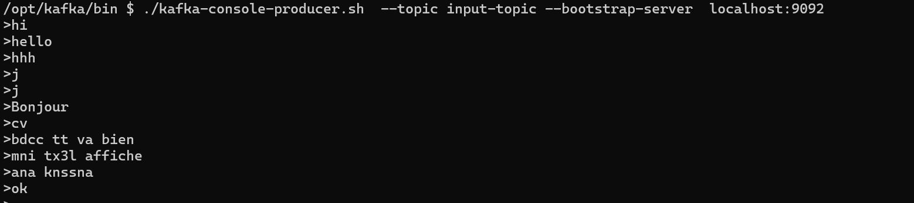
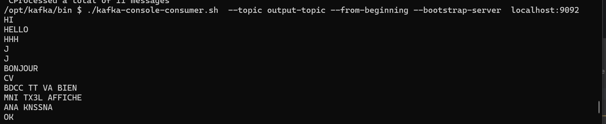

```shell
#Lancer le sh du broker container avec emplacemnt par defaut  /opt/kafka/bin
#lance le conteneur avec emplacemtn /opt/kafka/bin
docker exec --workdir /opt/kafka/bin -it broker sh
#Creer topics avec partions cad combien de partitons creer on va cree que une seul 
# replication cad que un seul
# partitions cad ce topic on va le diviser sur combien de partitions 
# car jai un seul broker , je vais creer un seul partiton 
#replication que 1 car jai un seul broker 
./kafka-topics.sh  --create --topic input-topic --bootstrap-server  localhost:9092 --partitions 1 --rep
lication-factor 1
#lister els topics existants
./kafka-topics.sh  --list --bootstrap-server  localhost:9092
#On creer lapp kafka stream s avc java
#La il faut ajouter dependance kafka strema smaven dependency 
```
```xml
 <dependencies>
    <dependency>
        <groupId>org.apache.kafka</groupId>
        <artifactId>kafka-streams</artifactId>
        <version>3.7.0</version>
    </dependency>

</dependencies>
```
La topolige : ou la topologie processor comem le lineage des rdds 
On les noeuds c eux qui font traintenment et les liens c eux qui ont des flux ou des streams 
pour Les types de processors ya 3 type 
source processor lui qui lit le strema dentre 
stream processor lui qui applique les traitmment 
sink processor lui qui forunit le res final ou stream final 
Pour Les objs les plus importants  a:
Kstream : represnete un streame en java c lien les kstream et les noeuds c les processor 
represnete que un flux de cle val , chaue  evt triater indepnedamtne 
Mes obj doivent etre ss forme des kstreams

KTable:
Represnnte une vue materialse de sdonnes     , les maj remplacent les vlas precedentes pour chaque cle
```java
//properties avec id , app li les val ss forme cle val et c sys distribue donc on doit specifier les types utilsier pour cle et val 
```
```shell
#lancer le producer 
 ./kafka-console-producer.sh  --topic input-topic --bootstrap-server  localhost:9092
# lancer consumer 
./kafka-console-consumer.sh  --topic output-topic --from-beginning --bootstrap-server  localhost:9092
```


