# TP 8: Kafka Streams
## Exercice 1 : Analyse de Données texte
### On souhaite implémenter une application Kafka Streams qui traite des messages texte envoyés
### dans un topic Kafka. - Tâches à réaliser
1. Créer les topics suivants :
   - text-input
   - text-clean
  - text-dead-letter
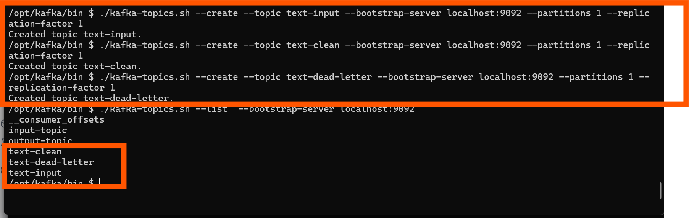
2. Lire les messages du topic text-input Chaque message est une simple chaîne de caractères.
3. Effectuer les traitements suivants :
   - Supprimer les espaces avant/après (trim)
   - Remplacer les espaces multiples par un seul espace
   - Convertir la chaîne en majuscules
```java
    //Exercice 1 : Analyse de Données texte
    public static void main(String[] args) {
     // 1. Configuration des propriétés de l'application kafka streams
        Properties props = new Properties();

        // Adresse du broker Kafka (serveur + port)
        props.put("bootstrap.servers", "localhost:9092");
        // Identifiant unique de l'application Kafka Streams
        props.put("application.id", "exercice1");
        // Configuration de la sérialisation/désérialisation des données
        // Kafka Streams manipule des données sous forme clé/valeur
        // Il est donc nécessaire de définir les types utilisés pour key et value:
        props.put("default.key.serde","org.apache.kafka.common.serialization.Serdes$StringSerde");
        props.put("default.value.serde","org.apache.kafka.common.serialization.Serdes$StringSerde");
     // 2.Construction de la topologie de traitement des flux
        StreamsBuilder builder = new StreamsBuilder();
     // 3. Lecture/Définition du flux source à partir du topic "text-input"
        KStream<String ,String> sourceStream=builder.stream("text-input");
     // 4. Application d'une transformation sur le flux :
        // conversion des valeurs en majuscules (les clés restent inchangées)
        // Suppr les espaces via trim et rendre tt en majuscule
        KStream<String,String> streamProcessor= sourceStream.mapValues(
                value -> value
                .trim()
                .replaceAll("\\s+","")
                .toUpperCase()
        );
```
4. Filtrer les messages selon les règles suivantes :
   - Rejeter les messages vides ou constitués uniquement d’espaces
   - Rejeter les messages contenant certains mots interdits (ex. : HACK, SPAM,
   XXX)
   - Rejeter les messages dépassant une longueur de 100 caractères
```java
        List<String> motsInterdits= Arrays.asList("HACK", "SPAM","XXX");
        KStream<String,String> streamProcessorFilterValides= streamProcessor.filter(
        (k,v)-> !( v.equals("")) &&
                !(v.matches(".*X{2,}.*")) &&
                !(Arrays.stream(v.split(" ")).anyMatch(val-> (motsInterdits.contains(val)))) &&
                !(v.length()>100));
        //Messages invalides
        KStream<String,String> streamProcessorFilterInvalides= streamProcessor.filter(
                (k,v)->
                        (Arrays.stream(v.split(" ")).anyMatch(val-> (motsInterdits.contains(val)))) ||
                                (v.matches(".*X{2,}.*"))||
                                (v.length()>100)
        );
        
```
5. Routage :
   - Les messages valides (après filtrage + nettoyage) sont envoyés dans le topic text-clean
   - Les messages invalides sont envoyés tels quels dans le topic text-dead-letter
```java
// 5. Envoi du flux des messages valides  transformé vers le topic de sortie "text-clean"
        streamProcessorFilterValides.to("text-clean");
        // Envoi du flux des messages invalides  transformé vers le topic de sortie "text-clean"
        streamProcessorFilterInValides.to("text-dead-letter");

      // 6. Création de l'instance Kafka Streams avec la topologie et la configuration
        KafkaStreams streams = new KafkaStreams(builder.build(), props);
      //  7.Démarrage de l'application Kafka Streams
        streams.start();
      // 8. Ajout d'un hook pour arrêter proprement l'application lors de l'arrêt du programme
      // L'app reste en ecoute
        Runtime.getRuntime().addShutdownHook(new Thread(streams::close));
```
6. Tester :
   - Envoyer plusieurs messages (valides / invalides) dans text-input
   -  Vérifier que les messages apparaissent dans le bon topic (text-clean ou text-dead-letter)
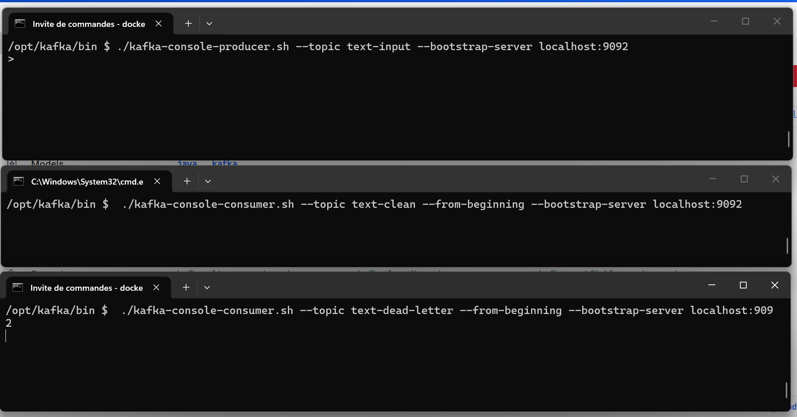
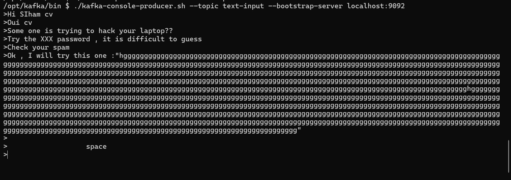
txt input
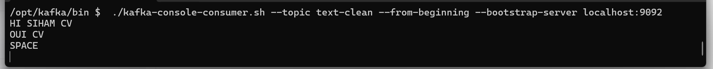
txt clean
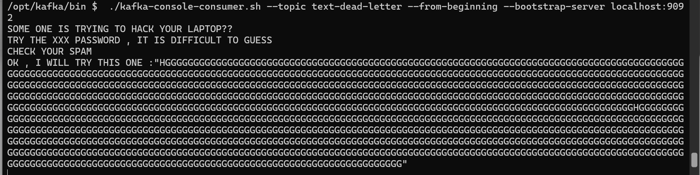
txt dead letter

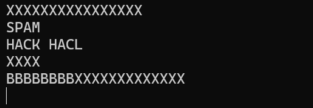


### Exercice 2:
Exercice 2 : Analyse de Données Météorologiques
Une entreprise collecte des données météorologiques en temps réel via Kafka. Chaque
station météorologique envoie des messages dans le topic Kafka nommé 'weather-data'. Les
messages ont le format suivant :
station,temperature,humidity
- station : L'identifiant de la station (par exemple, Station1, Station2, etc.). 
- temperature : La température mesurée (en °C, par exemple, 25.3). 
- humidity : Le pourcentage d'humidité (par exemple, 60).
Vous devez créer une application Kafka Streams pour effectuer les transformations suivantes:

1. Lire les données météorologiques : Lisez les messages depuis le topic Kafka 'weather-data'
   en utilisant un flux (KStream).
```java
 // 1. Configuration Kafka Streams
        Properties props = new Properties();
        props.put("bootstrap.servers", "localhost:9092");//adress borker kafka
        props.put("application.id", "KafkaStreamsSession2-Application");// id app
        //specification des types des donnees qui seront serialiser
        props.put("default.key.serde","org.apache.kafka.common.serialization.Serdes$StringSerde");
        props.put("default.value.serde","org.apache.kafka.common.serialization.Serdes$StringSerde");

        StreamsBuilder builder = new StreamsBuilder();

        // 2. Lecture du topic
        KStream<String, String> weatherDataStream =
                builder.stream("weather-data");

        // 8. Envoi vers topic final
        weatherDataStream.to("station-averages");

        // 9. Lancement
        KafkaStreams streams = new KafkaStreams(builder.build(), props);
        streams.start();

        Runtime.getRuntime().addShutdownHook(new Thread(streams::close));
```
NOus avons creer les topic et les lancer le producer et le consumer
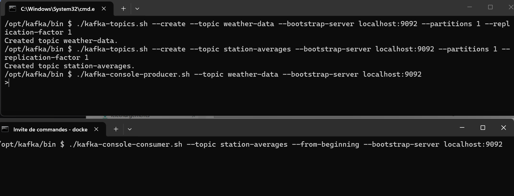
On envoie le flux dentres au tpic final pour verifier si les donnes arrive bien
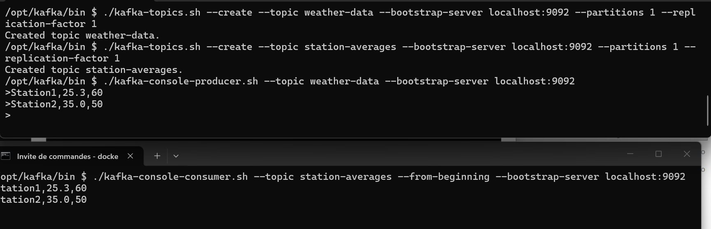
2. Filtrer les données de température élevée - Ne conservez que les relevés où la température est supérieure à 30°C. - Exemple : - Input : Station1,25.3,60 | Station2,35.0,50 - Output : Station2,35.0,50

```java
// 3. Filtrage (température >= 30)
        KStream<String, String> filtered =
                weatherDataStream.filter((k, v) -> {
                    try {
                        String[] parts = v.split(",");
                        return parts.length >= 3 &&
                                Double.parseDouble(parts[1]) >= 30;
                    } catch (Exception e) {
                        return false;
                    }
                });
// 8. Envoi vers topic final
        filtered.to("station-averages");

// 9. Lancement
KafkaStreams streams = new KafkaStreams(builder.build(), props);
        streams.start();

        Runtime.getRuntime().addShutdownHook(new Thread(streams::close));
```
Nous avons en resultat en affcichage que les filtered:
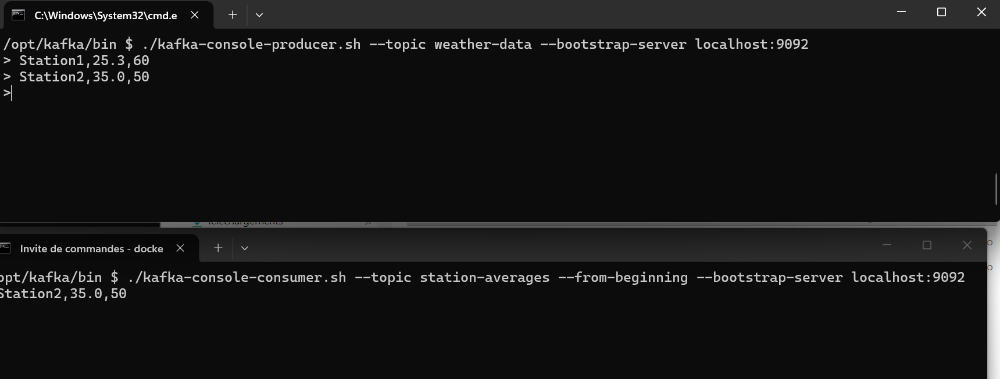
3. Convertir les températures en Fahrenheit - Convertissez les températures mesurées en degrés Celsius (°C) en Fahrenheit (°F) avec la
   formule : Fahrenheit = (Celsius * 9/5) + 32 - Exemple : - Input : Station2,35.0,50 - Output : Station2,95.0,50

```java
// 4. Conversion Celsius -> Fahrenheit
        KStream<String, String> fahrenheit =
                filtered.mapValues(v -> {
                    String[] p = v.split(",");
                    double temp = Double.parseDouble(p[1]);
                    double f = temp * 9.0 / 5.0 + 32;
                    return p[0] + "," + f + "," + p[2];
                });
// 8. Envoi vers topic final
        fahrenheit.to("station-averages");
```
Resultat:
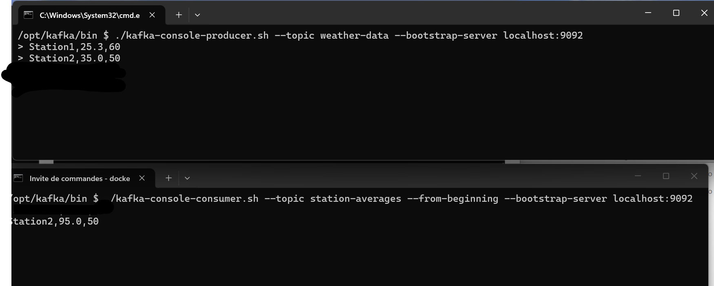
4. Grouper les données par station - Regroupez les relevés par station (station). - Calculez la température moyenne et le taux d'humidité moyen pour chaque station. 
- Exemple : - Input : Station2,95.0,50 | Station2,98.6,40 - Output : Station2,96.8,45 
```java
// 4. FIXER LA CLÉ = station ️ 
KStream<String, String> keyed =
        filtered.selectKey((k, v) -> v.split(",")[0]);

// 5. Groupement
KGroupedStream<String, String> grouped =
        keyed.groupByKey();

// 6. Agrégation (en Celsius)
KTable<String, String> agg =
        grouped.aggregate(
                () -> "0,0,0,0", // tempSum, tempCount, humSum, humCount

                (key, value, state) -> {

                   String[] s = state.split(",");
                   String[] p = value.split(",");

                   double temp = Double.parseDouble(p[1]);
                   double hum = Double.parseDouble(p[2]);

                   double tempSum = Double.parseDouble(s[0]) + temp;
                   double tempCount = Double.parseDouble(s[1]) + 1;

                   double humSum = Double.parseDouble(s[2]) + hum;
                   double humCount = Double.parseDouble(s[3]) + 1;

                   return tempSum + "," + tempCount + "," + humSum + "," + humCount;
                },

                Materialized.with(Serdes.String(), Serdes.String())
        );

// 7. Calcul des moyennes + conversion finale
KStream<String, String> result =
        agg.toStream().mapValues((key, state) -> {

           String[] s = state.split(",");

           double tempMoyC = Double.parseDouble(s[0]) / Double.parseDouble(s[1]);
           double humMoy = Double.parseDouble(s[2]) / Double.parseDouble(s[3]);

           // Conversion en Fahrenheit à la FIN
           double tempMoyF = tempMoyC * 9.0 / 5.0 + 32.0;

           return key + " : Température Moyenne = " + tempMoyF +
                   "°F, Humidité Moyenne = " + humMoy + "%";
        });


// 8. Envoi vers topic final
        result.to("station-averages",Produced.with(Serdes.String(),Serdes.String()));

```

5. Écrire les résultats
   Publiez les résultats agrégés dans un nouveau topic Kafka nommé 'station-averages'.
   - Contraintes - Utilisez les concepts de KStream, KTable, et KGroupedStream. - Gérer les données en assurant une sérialisation correcte. - Assurez un arrêt propre de l'application en ajoutant un hook.
   - Objectif
   À la fin de l'exercice, votre application Kafka Streams doit :
1. Lire les données météo depuis le topic 'weather-data'.
2. Filtrer et transformer les relevés météorologiques.
3. Publier les moyennes de température et d'humidité par station dans le topic 'station-averages'.
Exemple de Résultat:
   Données dans le topic weather-data :
   Station1,25.3,60
   Station2,35.0,50
   Station2,40.0,45
   Station1,32.0,70
Données publiées dans le topic station-averages :
   Station2 : Température Moyenne = 37.5°F, Humidité Moyenne = 47.5%
   Station1 : Température Moyenne = 31.65°F, Humidité Moyenne = 65% 
Nous avons le resultats:
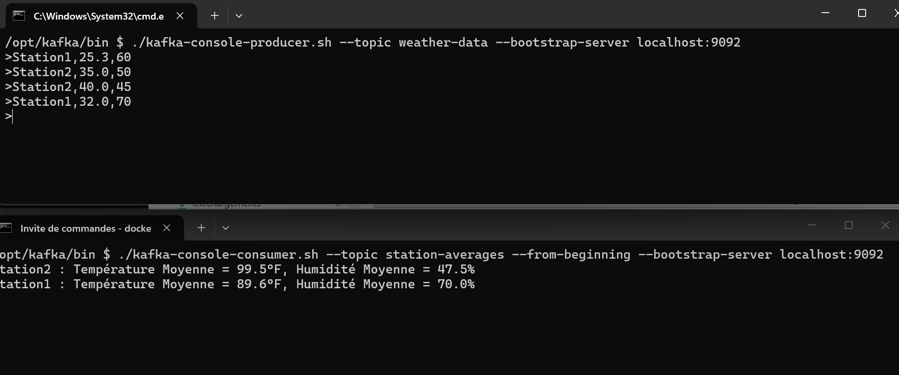


### Exercice 3 : Calcul du nombre de clics avec Kafka Streams et Spring Boot
   Dans cet exercice, vous allez développer une solution complète basée sur Kafka Streams et
Spring Boot pour suivre et analyser les clics des utilisateurs en temps réel. Le but est de
concevoir une application web où les utilisateurs peuvent cliquer sur un bouton, et chaque
clic sera enregistré et comptabilisé. Les données de clics seront traitées en temps réel à l'aide
de Kafka Streams, et les résultats seront exposés via une API REST. Ce projet vise à familiariser
   les étudiants avec le fonctionnement de Kafka, Kafka Streams, et leur intégration avec Spring
   Boot dans une architecture orientée événements.
   - Producteur Web :
   * Développez une application web Spring Boot qui expose une interface simple
   contenant un bouton "Cliquez ici".
   * Chaque clic sur ce bouton doit envoyer un message à un cluster Kafka. Le message doit
   inclure une clé (par exemple, userId) pour identifier l'utilisateur et une valeur ("click")
   pour représenter l'action.
    
   * Configurez le producteur pour publier ces messages dans un topic Kafka nommé clicks.
   - Application Kafka Streams :
   - Créez une application Kafka Streams qui consomme les messages du topic clicks.
   - Implémentez un traitement pour compter dynamiquement le nombre total de clics
   (soit globalement, soit par utilisateur).
   - Configurez l'application pour produire les résultats dans un autre topic Kafka nommé
   click-counts.
   - Consommateur REST :
   - Développez une autre application Spring Boot qui consomme les données du topic
   Kafka click-counts.
   - Implémentez une API REST avec un endpoint (GET /clicks/count) qui retourne le nombre
   total de clics en temps réel.
## On cree un projet spring boot avec les depndancs:
Spring web :C’est le module Spring utilisé pour créer des applications web et APIs REST.
thymleaf : moteur de rendu html 
lomboc: framework qui automatise la generation du code repetitif
kafka : pour l envoi des msg vers tpopics , cad lire et ecrire msgs
kafka-streams: pour faire le traitmenet en temps reel

| 🔴 Spring Kafka        | 🟣 Kafka Streams        |
| ---------------------- | ----------------------- |
| Lire / écrire messages | Traiter flux de données |
| Code simple            | Logique avancée         |
| Pas de state           | Statefull processing    |
| Consumer classique     | Pipeline de traitement  |
